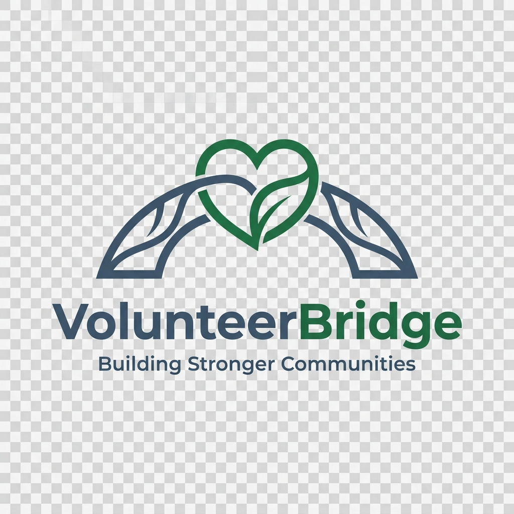

# VolunteerBridge — Building Bridges, Strengthening Community



> **Where local needs find local hearts.** VolunteerBridge is a smart community platform designed for the **Google Solution Challenge 2026**. We connect neighbors with neighbors to solve local needs together in real-time, transforming technical coordination into human-centric community building.

---

## 🌟 The Vision
In many communities, the gap between a "need" and a "helping hand" is often just a lack of connection. VolunteerBridge acts as a digital infrastructure—a bridge—that maps local NGO requirements to the unique talents of resident neighbors. By humanizing the data and smart-matching skills to situations, we build safer, smarter, and more resilient villages.

## 🚀 Key Modules

| Module | Purpose | Keywords |
| :--- | :--- | :--- |
| **Helping Hub** | NGO mission reporting & data entry | *Report a Need, NGO Panel* |
| **Bridge Builders** | Volunteer skill-based registration | *Join as Volunteer, Neighbor* |
| **Community Map**| Real-time impact & urgency analytics | *Dashboard, Charts, Trends* |
| **Smart Match** | AI-powered skill-to-need alignment | *Find Help, Ranked Results* |

## 🛠️ Tech Stack
- **Core**: Semantic HTML5, Vanilla CSS3 (Modern Nature Design System), JavaScript (ES6+)
- **Backend**: **Firebase Firestore** for real-time data persistence and live state updates.
- **Intelligence**: **Anthropic Claude API** for intelligent, context-aware volunteer ranking.
- **Analytics**: **Chart.js** for visualizing community impact and urgency levels.
- **Micro-Interactions**: **Lucide Icons** & CSS Grid/Flexbox for a premium, responsive UX.

---

## ⚙️ Quick Start Guide

### 1. Firebase Integration
1.  Create a project in the [Firebase Console](https://console.firebase.google.com).
2.  Enable **Firestore Database** in Test Mode.
3.  Register a Web App and copy your `firebaseConfig`.
4.  Replace the placeholder config in `index.html`, `ngo.html`, `volunteer.html`, `dashboard.html`, and `match.html`.

### 2. AI Smart Matching Setup
1.  Obtain an API key from [Anthropic Console](https://console.anthropic.com).
2.  In `match.html`, locate the headers in the `fetch()` call and add your key:
    ```javascript
    "x-api-key": "YOUR_ANTHROPIC_KEY_HERE",
    "anthropic-version": "2023-06-01",
    "anthropic-dangerous-direct-browser-access": "true"
    ```

### 3. Local Development
1.  Open the project in VS Code.
2.  Use the **Live Server** extension to launch `index.html`.
3.  Navigate to `http://127.0.0.1:5500`.

---

## 📂 Project Structure
- `index.html`: Premium landing page with live community stats.
- `ngo.html`: The Helping Hub for NGO mission reporting.
- `volunteer.html`: Registration portal for community Bridge Builders.
- `dashboard.html`: The Community Map showing live impact analytics.
- `match.html`: Intelligence layer for AI-driven volunteer matching.
- `app.js` & `style.css`: Core logic and the "Modern Nature" design system.
- `seed_demo.js`: Utility script to populate the database with demo missions.

---

## 🏆 Google Solution Challenge 2026
This project is built with passion and precision to address the UN Sustainable Development Goals, focusing on **Sustainable Cities and Communities (Goal 11)** and **Partnerships for the Goals (Goal 17)**.

**Connecting hearts, crossing bridges.**

